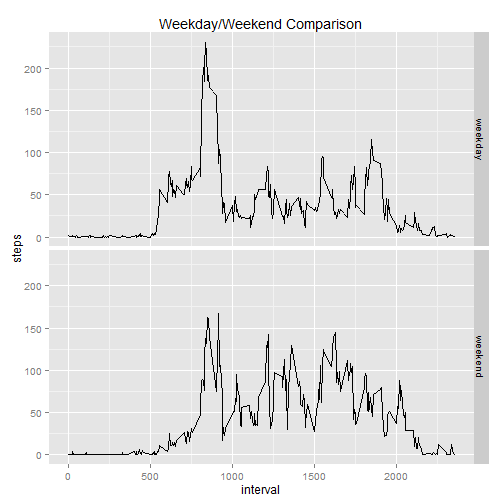

Peer Assessment 1
=================

### Loading and Preprocessing the Data

The data looks clean, so no processing necessary


```r
data <- read.csv("activity.csv")
```
### What is mean total number of steps taken per day?

Sum the number of steps for each day


```r
dailysteps <- tapply(data$steps, data$date, sum)
```
Create a histogram that shows the number of steps taken each day


```r
hist(dailysteps, main = "Histogram of Daily Steps", xlab = "Daily Steps")
```

 

Compute and report the mean of the total number of steps taken each day


```r
mean(dailysteps, na.rm = TRUE)
```

```
## [1] 10766.19
```
Compute and report the median of the total number of steps taken each day


```r
median(dailysteps, na.rm = TRUE)
```

```
## [1] 10765
```
###What is the average daily activity pattern?

Split the data into five-minute intervals, average the steps for those intervals,
and construct a time series plot across all days


```r
intervalsplits <- split(data, data$interval, drop = TRUE)
splitmeans <- sapply(intervalsplits, function(x) mean(x$steps, na.rm = TRUE))
plot(splitmeans, type = "l", main = "Average Number of Steps Taken in Each Five-Minute Block", xlab = "Five-Minute Block Number", ylab = "Average Steps")
```

 

Which five-minute interval contains the maximum average number of steps?  
The first number is the name of the time block; second is the block number


```r
which.max(splitmeans)
```

```
## 835 
## 104
```

###Imputing missing values

Calclate and report total rows with missing values


```r
fullrows <- complete.cases(data)
nrow(data) - sum(fullrows)
```

```
## [1] 2304
```

Fill in missing values with mean for that five-minute interval


```r
noNAdata <- data
for (row in 1:nrow(data)) {
     if (is.na(data[row, 1])) {
            intervalname <- as.character(data[row, 3])
            for (index in 1:length(splitmeans)) {
                    if (names(splitmeans[index]) == intervalname) {
                          noNAdata[row, 1] <- splitmeans[[index]]  
                    }
            }
     }   
}
```
Create a histogram that shows the number of steps taken each day after imputing the missing values


```r
noNAdailysteps <- tapply(noNAdata$steps, noNAdata$date, sum)
hist(noNAdailysteps, main = "Histogram of Daily Steps After Imputing Missing Values", xlab = "Daily Steps")
```

 

Compute and report the mean of the total number of steps taken each day


```r
mean(noNAdailysteps)
```

```
## [1] 10766.19
```
Compute and report the median of the total number of steps taken each day


```r
median(noNAdailysteps)
```

```
## [1] 10766.19
```

Imputing the missing data had no impact on the estimates of the total daily number of steps

###Are there differences in activity patterns between weekdays and weekends?  

Create a new variable indicating whether the day is a weekday or weekend


```r
noNAdata$date <- as.Date(strptime(noNAdata$date, format = "%Y-%m-%d"))
noNAdata$day <- weekdays(noNAdata$date)
for (row in 1:nrow(noNAdata)) {
        if (noNAdata[row, ]$day %in% c("Saturday", "Sunday")) {
                noNAdata[row, ]$day <- "weekend"
        }
        else {
                noNAdata[row, ]$day <- "weekday"     
        }
}
```

Make a panel plot of five-minute intervals and average steps taken showing weekday/weekend comparison using ggplot


```r
noNAsplitmeans <- aggregate(noNAdata$steps ~ noNAdata$interval + noNAdata$day, noNAdata, mean)
names(noNAsplitmeans) <- c("interval", "day", "steps")
library(ggplot2)
qplot(interval, steps, data = noNAsplitmeans, facets = day~., geom = "line", main = "Weekday/Weekend Comparison")
```

 
